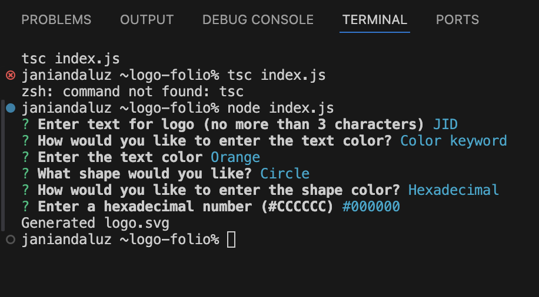
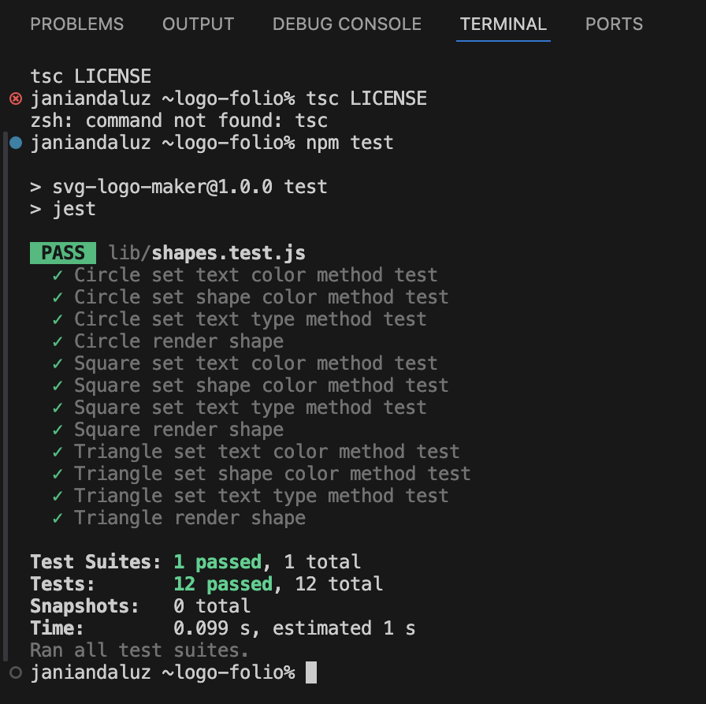

# The Logo Folio

[](https://github.com/Thecaprifire)
[](https://choosealicense.com/licenses/mit/)
  
## Description:
Logo Folio is an interactive application where users can input their preferences using an inquirer prompt. Based on these inputs, the application generates a customized SVG image file named “logo.svg,” showcasing the user’s desired design.

 ## Table of Contents
  * [Description](#description)
  * [The Challenge](#the-challenge)
  * [User Story](#user-story)
  * [Acceptance Criteria](#acceptance-criteria)
  * [Usage Instructions](#usage-instructions)
  * [Walkthrough Video](#walkthrough-video)
  * [Screenshots](#screenshots)
  * [Installation Process](#installation-process)
  * [Resources](#resources)
  * [Questions](#questions)
  * [License](#license)

## The Challenge:
Develop a Node.js command-line application that prompts users for inputs to create an SVG logo, saving it as a “logo.svg” file. Additionally, produce a comprehensive walkthrough video demonstrating the application’s functionality and successful completion of all tests.


## User Story
```md
AS a freelance web developer
I WANT to generate a simple logo for my projects
SO THAT I don't have to pay a graphic designer
```

## Acceptance Criteria
```md
GIVEN a command-line application that accepts user input
WHEN I am prompted for text
THEN I can enter up to three characters
WHEN I am prompted for the text color
THEN I can enter a color keyword (OR a hexadecimal number)
WHEN I am prompted for a shape
THEN I am presented with a list of shapes to choose from: circle, triangle, and square
WHEN I am prompted for the shape's color
THEN I can enter a color keyword (OR a hexadecimal number)
WHEN I have entered input for all the prompts
THEN an SVG file is created named `logo.svg`
AND the output text "Generated logo.svg" is printed in the command line
WHEN I open the `logo.svg` file in a browser
THEN I am shown a 300x200 pixel image that matches the criteria I entered
```

## Usage Instructions
1.	Open the cloned repository in your preferred source code editor (e.g., Visual Studio Code).
2.	Navigate to the directory containing index.js.
3.	Open an integrated terminal and run node index.js.
4.	Follow the prompts in the command-line interface provided by npm inquirer, responding to each question sequentially.
5.	Upon completion, an SVG file named “logo.svg” will be generated.
6.	Optionally, you can rename the “logo.svg” file to suit your preferences.
7.	(Optional) Customize the prompts in index.js to tailor the application to your specific requirements for future use.
8.	(Optional) Feel free to modify the application’s files to enhance and personalize the generated “logo.svg” file as needed.


## Walkthrough Video:
[Click Here to Watch](https://youtu.be/sv7BrslOOwE?si=ES1h9TzQtAuHhy4f)

## Screenshots:
### Figure 1. Command line application
 
### Figure 2. Jest Testing "npm test"

### Figure 3. Generated "logo.svg" file


## Installation Process
1. Clone the repository: [Logo Folio](https://github.com/Thecaprifire/logo-folio)
2. Install the following: 
- Node.JS [Version 20.14.0](https://nodejs.org/en/blog/release/v20.14.0/)
- Jest [Version 24.9.0](https://www.npmjs.com/package/jest)
- Inquirer.js: [Version 8.2.4](https://www.npmjs.com/package/inquirer/v/8.2.4)
3. Open the cloned repository in any source code editor.
4. Open the integrated terminal for the document and complete the respective installation guides provided above in section (2.) to ensure the cloned documentation will operate.


## Resources
- Dynamic JavaScript
- Node.JS [Version 20.14.0](https://nodejs.org/en/blog/release/v20.14.0/)
- Jest [Version 24.9.0](https://www.npmjs.com/package/jest)
- Inquirer.js: [Version 8.2.4](https://www.npmjs.com/package/inquirer/v/8.2.4)
- License Badge: [Shields.io](https://shields.io/)
- Visual Studio Code: [Website](https://code.visualstudio.com/)

  
## Questions
  Contact the author with any questions!<br>
  Github link: [Thecaprifire](https://github.com/Thecaprifire)<br>
  Email: ianjandaluz@gmail.com


## License
  This project is [MIT](https://choosealicense.com/licenses/mit/) licensed.<br />

  Copyright © 2024 [JAN IAN DALUZ](https://github.com/Thecaprifire)
  
  <hr>
  <p align='center'><i>
  Here’s to your coding journey! 🎉 JAN IAN DALUZ
  </i></p>